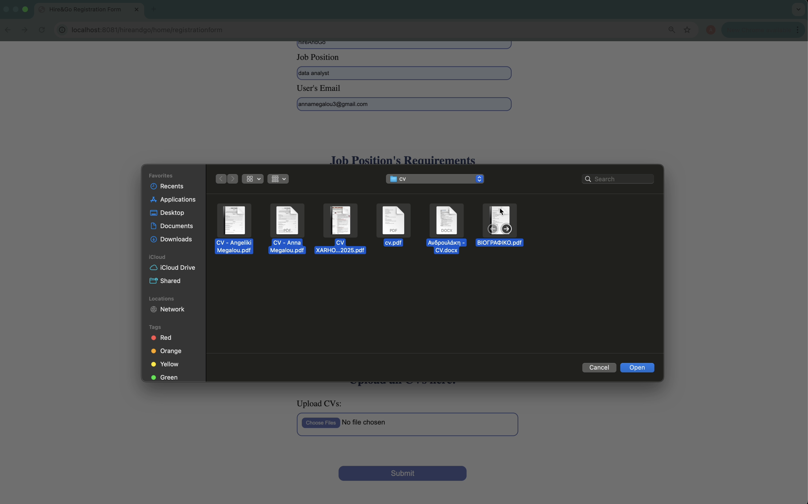

#Techleads

# Hire&Go

## Project Description

**Hire&Go** is a software application designed to optimize the candidate selection process in businesses by leveraging AI assistants. It efficiently ranks resumes based on their suitability for a specific job position. 

The process of using the application is as follows:
1. **Complete the form**: The user (company representative) provides their details and specifies the job position.
2. **Attach resumes**: Users upload resumes to the form (preferred formats: `.doc` and `.pdf`).
3. **Resume ranking**: The system uses OpenAI assistants to rank resumes based on their relevance.
4. **Results delivery**: An email is sent to the user containing a link to a webpage where the ranked resumes can be reviewed.

---

## Workflow Illustration

The following images will illustrate the workflow or the prodject


 Welcome to our Home Page! Here, you can learn about our Services, discover key details About Us, and find our Contact Information.
 When you click on "Get Started," you’ll be redirected to our Registration Form.


 Fill in the required fields to complete your registration.




 Your Registration is Successful! Shortly, you will receive an email from Us with a link to the Ranked Candidates.


 Follow the link to view the Ranked Candidates!
 


---

## Compilation Instructions

### Prerequisites
- **Java Development Kit (JDK)** version 17 or higher  
- **Apache Maven**
- **PostgreSQL**

### Compilation Steps
1. Check Maven installation:  
   ```bash
   mvn -v
2. Clean the prodject:
   ```bash
   mvn clean
3. Built the prodject:
   ```bash
   mvn clean install
4. Compile the prodject:
   ```bash
   mvn clean compile
5. Package the application:
   ```bash
   mvn package
6. Run tests:
   ```bash
   mvn test 
7. Execute the application as a standalone JAR file:
   ```bash
   java -jar target/<file-name>.jar

---

## Execution Instructions 

1. To run the program:
   ```bash
   mvn spring-boot:run

---

## User Guide

1. Clone the Repository: Clone the TechLeads repository from GitHub using the command:
   ```bash
   git clone https://github.com/Anna8230094/TechLeads.git
2. Set Up env.properties: Create an env.properties file based on the env.properties.example file. Populate the required fields in the resources/templates directory, including:
   - **Database connection details**
   - **OpenAI key**
   - **User's email address**
3. Install PostgreSQL: Ensure that PostgreSQL is installed on your system before running the application.
4. Upload Resumes: When running the program, all resumes must be uploaded simultaneously by dragging them into the form on the `RegistrationForm.html` page.
5. Tip: During execution, the first page users will see is the **Home Page**. Access it in a browser using:
   ```text   
   http://localhost:8081/hireandgo/home/

---

## UML Diagram: Code Design


---

## Licenses

This project integrates OpenAI services. Use of OpenAI APIs and services is governed by OpenAI's Terms of Service ([Terms of Service](https://openai.com/terms)) and API Terms ([API Terms](https://openai.com/api-terms)). Users of this project must comply with these terms.

---

## Dependencies and their Licenses

This project uses the following dependencies:

- **Apache License 2.0**: Licensed under the [Apache License 2.0](http://www.apache.org/licenses/LICENSE-2.0).
- **Eclipse Public License 2.0**: Licensed under the [Eclipse Public License 2.0](https://www.eclipse.org/legal/epl-2.0/).
- **MIT License**: Licensed under the [MIT License](https://opensource.org/licenses/MIT).

For more information on each dependency and its licensing, please refer to their respective license links.